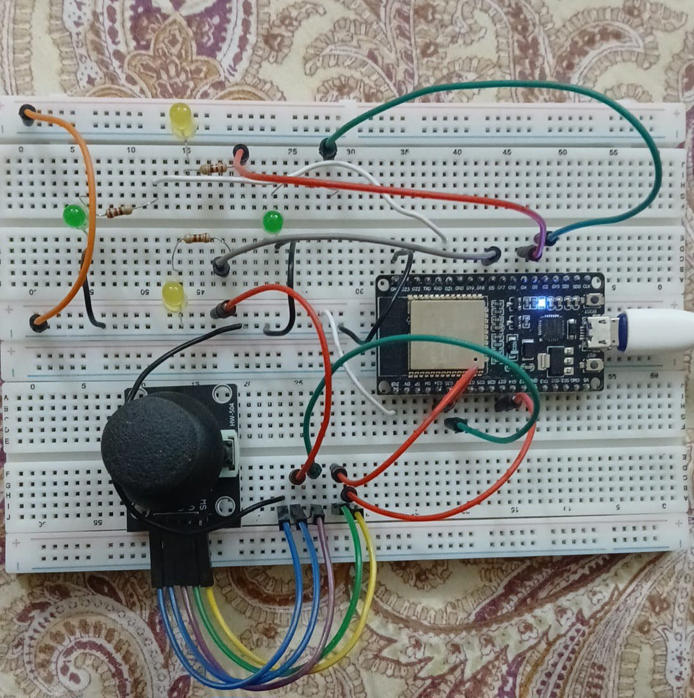
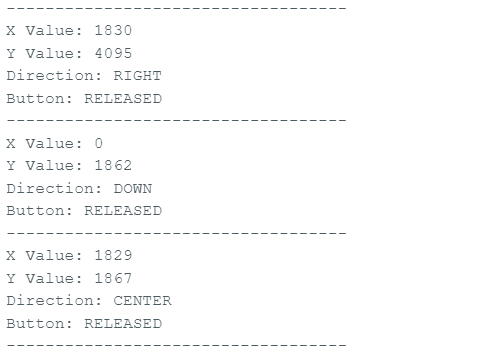

# Day 7: Joystick Manual Controller

## Project Description

This project uses an ESP32 and a joystick module to control four LEDs representing the left, right, up, and down directions.

The ESP32 reads the joystick's X-axis, Y-axis, and push-button values. Moving the joystick turns on the LED corresponding to the detected direction. Pressing the joystick button turns on all four LEDs simultaneously.

The joystick readings, detected direction, and button state are displayed on the Serial Monitor every second.

## Components Used

* ESP32 38-pin development board
* Joystick module
* Four LEDs
* Four 220 Ω resistors
* Breadboard
* Jumper wires
* USB cable

## Wiring

### Joystick Module

```text
Joystick VCC → ESP32 3.3V
Joystick GND → ESP32 GND
Joystick VRX → ESP32 GPIO 35
Joystick VRY → ESP32 GPIO 34
Joystick SW  → ESP32 GPIO 27
```

The joystick button uses the ESP32's internal pull-up resistor through `INPUT_PULLUP`.

### Left LED

```text
ESP32 GPIO 21 → 220 Ω resistor → LED anode
LED cathode → ESP32 GND
```

### Right LED

```text
ESP32 GPIO 2 → 220 Ω resistor → LED anode
LED cathode → ESP32 GND
```

### Up LED

```text
ESP32 GPIO 4 → 220 Ω resistor → LED anode
LED cathode → ESP32 GND
```

### Down LED

```text
ESP32 GPIO 5 → 220 Ω resistor → LED anode
LED cathode → ESP32 GND
```

## Working Principle

* The ESP32 reads the joystick every 1000 milliseconds.
* The X-axis and Y-axis provide analog values between approximately 0 and 4095.
* Values below `1200` or above `2800` are used to identify joystick movement.
* Moving the joystick left turns on the left LED.
* Moving the joystick right turns on the right LED.
* Moving the joystick up turns on the up LED.
* Moving the joystick down turns on the down LED.
* Keeping the joystick in the centre turns off all LEDs.
* Pressing the joystick button turns on all four LEDs.
* The button reads `LOW` when pressed because it uses `INPUT_PULLUP`.

## Direction Thresholds

```text
Y value below 1200  → LEFT
Y value above 2800  → RIGHT
X value above 2800  → UP
X value below 1200  → DOWN
Otherwise           → CENTER
```

## Serial Monitor Output

The Serial Monitor uses a baud rate of `115200`.

Example output:

```text
Joystick Manual Controller started
System Ready
-----------------------------------
X Value: 1935
Y Value: 2012
Direction: CENTER
Button: RELEASED
-----------------------------------
X Value: 1940
Y Value: 485
Direction: LEFT
Button: RELEASED
-----------------------------------
X Value: 1945
Y Value: 2030
Direction: CENTER
Button: PRESSED
```

## Concepts Learned

* Reading analog joystick values using `analogRead()`
* Reading an active-low push button
* Using `INPUT_PULLUP`
* Converting analog readings into directional commands
* Controlling multiple output LEDs
* Using functions to organise embedded-system code
* Using `millis()` for non-blocking timing
* Displaying sensor readings on the Serial Monitor

## Mistakes Fixed

* Correctly connected the joystick X-axis to GPIO 35.
* Correctly connected the joystick Y-axis to GPIO 34.
* Used ADC-capable ESP32 pins for the joystick axes.
* Used `INPUT_PULLUP` for the joystick push button.
* Handled the button as active-low, where `LOW` means pressed.
* Added lower and upper thresholds to avoid unstable direction detection near the centre.
* Turned all LEDs off before activating the required direction LED.
* Avoided using `delay()` by using a `millis()`-based interval.

## Demo Files

### Circuit Photo



### Serial Monitor Screenshot



### Video Demonstration

[Watch the joystick controller demonstration](joystick-demo.mp4)

## Embedded Systems Relevance

Joysticks are commonly used as manual input devices in embedded systems. They provide two analog inputs for directional movement and one digital input for selection.

This project demonstrates how embedded controllers translate physical user input into output actions. Similar control systems are used in robots, remote-controlled vehicles, industrial machines, gaming controllers, camera systems, and menu interfaces.
